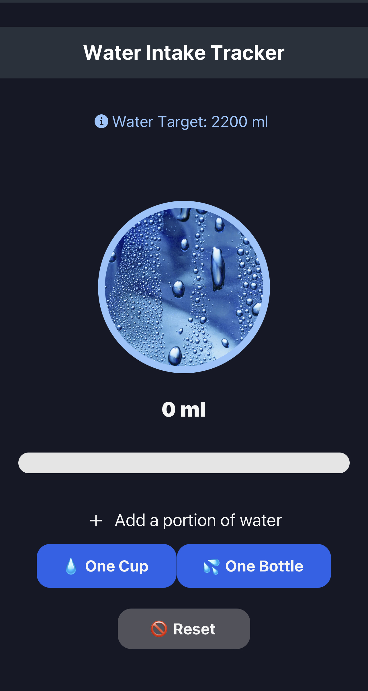

# Water Tracker App

Boca Code Week 8: The Water Tracker app is a web application designed to help you track your daily water intake and stay hydrated. It allows you to have a daily water goal, record the amount of water you drink throughout the day, and view your progress towards your goal.

## Features

- **View daily water goal**: You can view water intake goal for each day.
- **Log water intake**: Easily record the amount of water you drink throughout the day.
- **Track progress**: The app provides a visual representation of your progress towards your daily goal.
- **Daily summary**: View a summary of your water intake for the current day.

## Technologies Used

- React Native 
- Expo
- JavaScript

## Special Thanks

- Special thanks to [Boca Code](https://github.com/bocacode) for providing the learning environment for this project.

---

*This project was developed as part of the Boca Code curriculum.*